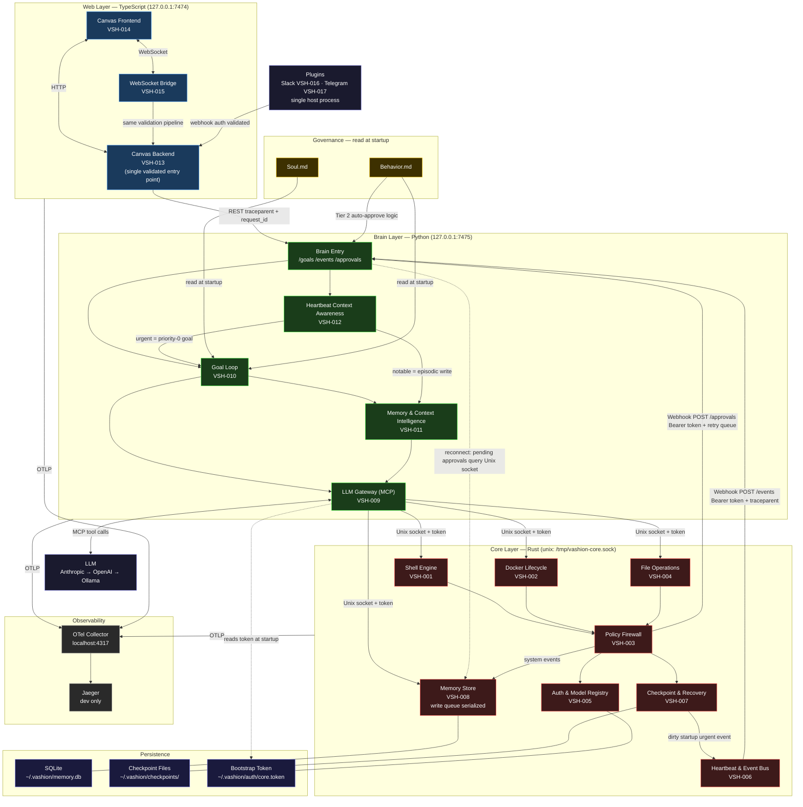

# Vashion — Build PRD
**Last Updated:** 2026-03-27
**Status:** Draft v3.2 — R3 minor items R3-O1 and R3-O2 resolved

---

## Project Header

**Name:** Vashion
**Branch:** `vashion/main`
**Purpose:** Local-first autonomous agent. Acts without being asked. Remembers without being reminded. Interrupts only for irreversible decisions.
**Tech Stack:** Rust (`core/`), Python (`brain/`), TypeScript (`web/`)
**Reference:** JAL — behavioral spec only, not a code source

### Quality Gates
| Order | Service | Command |
|---|---|---|
| 1 | `core/` | `cargo fmt --check && cargo clippy && cargo deny check && cargo test` |
| 2 | `brain/` | `ruff check && ruff format --check && mypy brain/src && pytest` |
| 3 | `web/` | `eslint && prettier --check && tsc --noEmit && jest --runInBand` |
| 4 | `e2e/` | Trace propagation test — assert `traceparent` survives `web → brain → core` |

---

## Phase 1 — Core (Rust)
> System-layer foundation. No LLM dependency. Pure execution, policy, and state.

---

### VSH-001 — Shell Execution Engine
**Service:** `core/` · **Priority:** 1

**Description:**
Rust-native shell execution engine with async streaming, cancellation, bounded timeouts, and structured command model. Firewall admission control occurs before any process is spawned.

**Execution model — prefer structured invocation:**
- Where shell semantics are not required (file copy, directory listing, process query, package install), use direct `execve`-style `argv` invocation via typed tool adapters — no shell parser, no expansion, no environment inheritance
- Use shell (bash/zsh) only when shell semantics are explicitly required (pipes, redirection, glob expansion)
- Explicit allowlist of permitted executables at `~/.vashion/policy/exec-allowlist.json`
- Explicit `cwd` required on every invocation — no inherited working directory
- Minimized environment: pass only explicitly declared env vars; strip parent environment by default

**Acceptance Criteria:**
- Supports structured argv invocation (primary) and shell invocation (secondary, explicitly flagged)
- Streaming stdout/stderr via `tokio::process`; output chunks delivered as they arrive — no buffering
- Caller can cancel any in-flight process; SIGTERM sent, then SIGKILL after 5s grace period
- Default timeout: 15 minutes; policy-extendable per command via VSH-003
- Every execution records PID, start time, output reference for VSH-007 crash recovery
- Command injection check on all inputs before FW classification — FW never sees raw untrusted input
- `sudo` blocked unconditionally at this layer — not delegated to VSH-003
- Executable not in allowlist: rejected before FW classification, structured error returned

**Firewall return contract (VSH-003 → VSH-001) — admission control before spawn:**
- **Tier 1** — `{ allowed: true, plan_token }`: SHELL spawns and executes
- **Tier 2** — `{ allowed: pending, plan_token }`: SHELL does NOT spawn; execution plan is held pending approval; caller notified of pending state; spawn occurs only after FW resolves `plan_token` as approved
- **Tier 3** — `{ allowed: false, reason, tier: 3 }`: SHELL does not spawn; structured error returned; no execution under any condition

**Safety Gates:**
- No process is spawned before FW returns `allowed: true` — admission control, not hold-after-spawn
- Tier 2 pending state is caller-visible — SHELL never silently blocks
- Tier 3 denial is final — no retry, no escalation
- Shell invocation mode requires explicit flag — default is structured argv

---

### VSH-002 — Docker Lifecycle Integration
**Service:** `core/` · **Priority:** 2

**Description:**
Rust-native Docker integration for managing local containers. All operations flow through the VSH-003 policy firewall.

**Acceptance Criteria:**
- Supports: `list`, `start`, `stop`, `build`, `inspect`, `logs` against local Docker daemon
- Streaming output contract identical to VSH-001
- Caller can cancel any in-flight Docker operation; termination logged
- Docker socket/group access preferred; `--privileged` blocked by default
- Every Docker operation classified by VSH-003 firewall before execution
- Destructive ops (`prune`, `rm`) classified as Tier 2 — require approval
- All privilege violations audit-logged with action, tier, and reason

**Firewall return contract (VSH-003 → VSH-002):** Identical to VSH-001 — admission control before execution. Tier 1 executes on `plan_token`. Tier 2 holds execution plan until `plan_token` resolved as approved — no Docker operation initiated before approval. Tier 3 returns structured denial; no operation under any condition.

**Safety Gates:**
- `--privileged` blocked by default; requires explicit policy exception
- `docker prune` and `docker rm` are Tier 2 — no auto-execution

---

### VSH-003 — Policy Firewall
**Service:** `core/` · **Priority:** 3

**Description:**
Deterministic policy firewall that classifies every action into a tier via a machine-verifiable `ActionDescriptor` schema. Soul.md and Behavior.md tune policy — they do not replace the classifier. Tier rules are evaluated against descriptor fields, not prose. Tier 2 is admission control before execution — no process is started before approval resolves.

**ActionDescriptor schema** — every action must carry all fields before classification:
```
operation_kind:        shell | docker | file | network | system | auth
target_scope:          local_workspace | outside_workspace | system | network
reversibility:         reversible | irreversible | unknown
privilege_required:    none | user | elevated | root
network_boundary:      none | loopback | lan | external
workspace_boundary:    inside | outside | unknown
data_sensitivity:      none | user_data | credentials | system_config
estimated_side_effects: none | low | high | unknown
```

**Tier classification rules** (evaluated deterministically against descriptor):
- **Tier 1 (auto-execute):** `reversibility=reversible` AND `privilege_required=none` AND `workspace_boundary=inside` AND `data_sensitivity=none` AND `estimated_side_effects=none|low`
- **Tier 2 (approval required):** any of — `reversibility=irreversible|unknown`; `workspace_boundary=outside`; `estimated_side_effects=high`; `data_sensitivity=user_data|system_config`; `privilege_required=user|elevated`
- **Tier 3 (blocked):** any of — `privilege_required=root`; `network_boundary=external`; `data_sensitivity=credentials`; `operation_kind=auth` with mutation

**Tier 2 — AutoApprovalPolicy:**
- Explicit allowlist of action classes eligible for auto-approval (deny-by-default outside allowlist)
- Auto-approval decision record is mandatory: `{ action_descriptor, rationale, decision_hash, approved_by: "brain", timestamp, nonce, ttl_seconds }`
- `decision_hash` ties approval to exact action parameters — a modified action requires a new approval
- Decision record written to operator-visible audit stream before execution proceeds
- Nonce is single-use; TTL default 30s — expired approval requires re-request
- If action class is not in auto-approval allowlist: escalate to Canvas WebSocket for user decision

**Tier 2 `/approvals` webhook — auth, delivery, and reconnect:**

Core makes an outbound HTTP POST to Brain's entry point at `127.0.0.1:7475/approvals`. This call is authenticated using the same session token as Brain→Core — the token is bidirectional. Core sends `Authorization: Bearer <token>` on every webhook call to Brain; Brain validates the token before processing.

Delivery guarantee (mirrors VSH-006 urgent queue model):
- Core retries `/approvals` delivery up to 3 times with exponential backoff
- If all retries fail (Brain unreachable), the approval request is written to a local pending-delivery queue in Core alongside the `plan_token` record in MEM_S
- On Brain reconnect (after rekey or restart), Core reconciliation step: Brain issues a `memory_query { filter: "approvals:pending" }` command over the Unix socket to MEM_S — same socket API used by all Brain→Core calls, not a new HTTP endpoint; Core returns all `status: pending` approval records; Brain re-surfaces them to Canvas via WebSocket
- Pending approval records in MEM_S retain `status: pending` until explicitly resolved; they do not expire silently

**Acceptance Criteria:**
- Every action classified via `ActionDescriptor` — missing or invalid descriptor is a hard rejection
- `TierDecision` written to audit log before execution for every action
- Tier 1: `plan_token` returned, execution proceeds immediately
- Tier 2: `plan_token` held; `AutoApprovalPolicy` evaluated first; auto-approve or escalate to user
- Tier 3: immediate structured rejection; audit log entry written; no bypass path
- Policy allowlist at `~/.vashion/policy/allowlist.json` — user-editable; every change audit-logged
- Core authenticates every outbound `/approvals` webhook with session token — unauthenticated calls rejected by Brain

**Safety Gates:**
- Descriptor fields are required — missing field = Tier 2 minimum; unknown fields never default to Tier 1
- Auto-approval allowlist is deny-by-default — unlisted action classes always escalate to user
- Decision hash enforced — modified action cannot reuse prior approval
- Tier 3 has no bypass — not even with explicit session-level approval
- `decision_hash` and `nonce` checked before every Tier 2 execution — stale approvals rejected
- No approval request is silently lost — undelivered requests sit in pending-delivery queue until Brain reconnects
- Brain restart never results in a pending approval with no visible prompt — reconciliation step on reconnect guarantees re-delivery

---

### VSH-004 — Policy-Bounded File Operations
**Service:** `core/` · **Priority:** 4

**Description:**
File system operations scoped to configured workspace roots with policy tier enforcement.

**Acceptance Criteria:**
- Supports: `read`, `write`, `delete`, `move`, `list` within configured workspace roots
- Workspace roots defined in `~/.vashion/config.toml`
- Reads within roots: Tier 1. Writes within roots: Tier 1. Operations outside roots: Tier 2.
- `delete` is always Tier 2 — irreversible, regardless of path
- Symlink traversal blocked by default; must not escape workspace root
- Every file operation audit-logged with path, operation, tier, and outcome

**Firewall return contract (VSH-003 → VSH-004):** Identical to VSH-001 — admission control before execution. Tier 1 executes on `plan_token`. Tier 2 holds execution plan until `plan_token` resolved as approved — no file operation initiated before approval. Tier 3 returns structured denial; no operation under any condition.

**Safety Gates:**
- Symlink escape detection on every path before FW classification — FW never sees an escaped path
- Delete always Tier 2 — no exception

---

### VSH-005 — Auth & Model Registry
**Service:** `core/` · **Priority:** 5

**Description:**
Encrypted credential storage and model registry for multi-provider LLM support. Manages Core↔Brain bootstrap auth with explicit token epoch and rekey handshake for Core restarts mid-session.

**Bootstrap auth and rekey protocol:**
- Core writes session token + epoch number to `~/.vashion/auth/core.token` (mode 600) on startup
- Token format: `{ token, epoch, issued_at, ttl }` — epoch increments on every Core restart
- Brain reads token at startup; sends `token` + `epoch` on every Unix socket connection
- Core validates both — wrong token OR stale epoch = immediate rejection
- **Rekey on Core restart mid-session:**
  1. Core restarts; writes new token with `epoch+1`
  2. Brain receives auth rejection on next socket call
  3. Brain detects epoch mismatch; enters `degraded` state — no new goal execution
  4. Brain reloads token file; rebinds Unix socket client with new token + epoch
  5. In-flight requests that straddled the restart fail closed with `{ error: "core_restart", retry: true }` — caller may retry once after rekey completes
  6. Brain exits degraded state; resumes normal operation

**Acceptance Criteria:**
- Stores model credentials encrypted at rest at `~/.vashion/auth/`
- Supports providers: Anthropic, OpenAI, local (Ollama)
- Active model switchable at runtime without restart
- Credentials never written to logs, memory DB, or audit trail — appear as `[REDACTED]`
- Model registry stores per-model: name, provider, context window, cost tier
- Registry queried by `brain` at startup to inform goal loop and context budgeting
- Auth state included in VSH-007 checkpoint so model context survives crashes
- Rekey handshake completes without manual intervention — Brain self-recovers from Core restart

**Safety Gates:**
- Credentials never logged — enforced at write layer, not caller convention
- Registry query is read-only; writes require explicit mutation call
- Stale epoch rejection is immediate — Brain never retries with a known-bad token
- Degraded state is operator-visible via Canvas health endpoint

---

### VSH-006 — Heartbeat & Event Bus
**Service:** `core/` · **Priority:** 6

**Description:**
Continuous environment monitoring with delta classification and push-based event delivery to `brain`. This is ambient awareness — not just a health check.

**Acceptance Criteria:**
- Runs on configurable interval (default: 60s; env: `VASHION_HEARTBEAT_INTERVAL`)
- On every pulse: snapshot processes, containers, disk, memory, network activity
- Diffs snapshot against previous; classifies each delta: `routine` / `notable` / `urgent`
- **Routine:** logged locally, not forwarded
- **Notable:** posted to `brain` via HTTP POST webhook at `127.0.0.1:7475/events` with `traceparent`
- **Urgent:** posted immediately, outside of pulse schedule — does not wait for next interval
- Pulse history retained for 24h; entries older than 24h pruned automatically

**Static urgent thresholds (always active, no warmup required):**
- Mandatory service down and not recovered within 2 pulses
- Disk usage > 85%
- Available memory < 512MB

**Anomaly detection — z-score model with defined lifecycle:**
- Baseline window: rolling 24h of pulse samples, per-metric (CPU%, mem bytes, per-process)
- Minimum sample count before z-score activates: **30 samples** (30 min at default interval)
- Cold-start (< 30 samples): fall back to static thresholds only — CPU > 90%, mem < 256MB
- Anomaly threshold: > 2σ from rolling mean, sustained for 2 consecutive pulses (burst suppression)
- Multi-process correlation: if > 3 processes simultaneously exceed threshold, escalate as single correlated event — do not emit one urgent event per process
- Dedup/coalescing: identical event type from same source suppressed for 5-minute cooldown window after first emission
- Escalation state machine per resource: `normal → warning (1σ) → urgent (2σ, 2 pulses) → sustained_urgent (> 5 pulses)` — `sustained_urgent` triggers re-escalation regardless of cooldown

**Safety Gates:**
- Webhook delivery retried up to 3 times with exponential backoff; failure written to audit log
- Urgent events never dropped — if webhook fails, written to local urgent queue and retried on next pulse
- Cooldown does not apply to static threshold breaches — disk > 85% is always re-escalated

---

### VSH-007 — Checkpoint & Crash Recovery
**Service:** `core/` · **Priority:** 7

**Description:**
Checkpoint-based state persistence for crash recovery. Surfaces dirty state to `brain` on restart — does not auto-resume.

**Acceptance Criteria:**
- Checkpoint written: before every Tier 2 operation, and on clean shutdown (SIGTERM/SIGINT)
- Checkpoint contains: active processes, open Docker operations, pending Tier 2 approvals, auth state reference, heartbeat cursor
- On startup: detect prior checkpoint file; classify as `clean` or `dirty`
- `dirty` checkpoint (prior crash): posted to Brain event bus as urgent event (same pipeline as VSH-006 heartbeat) before accepting any new commands
- `clean` checkpoint: loaded silently; state restored, Brain notified
- Checkpoint files persisted to disk at `~/.vashion/checkpoints/`; rotate — keep last 5, delete older
- Recovery does not auto-resume interrupted operations — reports state and waits for direction

**Safety Gates:**
- Checkpoint write is atomic (write to temp, rename) — no partial checkpoint files
- Dirty checkpoint always surfaced before new input accepted
- Checkpoint files never written to MEM_S — disk only, so recovery is independent of database state

---

### VSH-008 — Memory Store
**Service:** `core/` · **Priority:** 8

**Description:**
Two-tier memory storage — episodic (session-scoped) and durable (long-term). `brain` is the intelligence layer; `core` is the storage layer.

**Persistence:** SQLite at `~/.vashion/memory.db` (WAL mode).

**Write ownership model:** MEM_S has a single internal async write queue (tokio channel). All writes — from Core and from Brain — are serialized through this queue. No lock contention. No last-write-wins. Write source is tagged on every entry (`source: core | brain`).
- **Core writes:** system events — audit entries, heartbeat state, tier decisions, checkpoint references
- **Brain writes:** reasoning context, episodic summaries, durable promotion requests

**Acceptance Criteria:**
- Two stores: episodic (short-term) and durable (long-term, persisted across sessions)
- Episodic entries: timestamp, source service, content, relevance score, expiry (default 7 days)
- Durable entries: promoted from episodic by `brain` only; require `user_approved = true`
- Context budget enforced at item granularity — whole items dropped when over budget, never truncated mid-text
- Memory API exposed on Unix socket alongside other `core` commands
- Brain accesses MEM_S exclusively via the Unix socket memory API — no direct DB connection from Brain
- Episodic entries expire after 7 days unless promoted to durable

**Pending approval state:**
- All in-flight Tier 2 `plan_token` records stored in MEM_S (Core), not in Web or Brain process memory
- Web renders approval state by querying Core; it does not own it
- On Brain restart: Brain issues `memory_query { filter: "approvals:pending" }` over the Unix socket on reconnect — no new HTTP endpoint; Core returns all `status: pending` records; Brain re-surfaces them to Canvas via WebSocket — no approval prompt silently lost
- On Web restart/browser refresh: approval state re-loaded from Core via Canvas Backend `/approvals` endpoint
- Pending approval records never expire silently — `status: pending` records are retained until explicitly resolved (`approved`, `denied`) or manually cleared by the operator
- Approval state schema: `{ plan_token, action_descriptor, decision_hash, nonce, ttl, expires_at, status: pending|approved|denied|expired, delivery_attempts, last_delivery_at }`

**Safety Gates:**
- Durable write requires `user_approved = true` — enforced in write queue, not caller convention
- Context budget enforcement is a hard error — not a warning, not a soft limit
- Brain has no direct SQLite access — all reads and writes go through Core's Unix socket API
- Pending approval state lives in Core — not in any process that can be restarted without losing it

---

## Phase 2 — Brain (Python)
> Intelligence layer. LLM gateway, goal loop, context reasoning. Depends on Phase 1 complete.

---

### VSH-009 — LLM Gateway via MCP
**Service:** `brain/` · **Priority:** 9

**Description:**
Python MCP server that exposes Vashion's `core` capabilities as structured tools for LLM consumption. Also serves as the single Unix socket client for all Brain→Core communication — MEM_I and HB_CTX access Core through this layer, not directly.

**Bootstrap auth:** On startup, Core generates a session token + epoch and writes to `~/.vashion/auth/core.token` (mode 600). Brain reads token + epoch at startup; sends both on every Unix socket connection. On auth rejection, Brain detects epoch mismatch, enters degraded state, reloads token, rebinds — see VSH-005 rekey protocol for full spec.

**Unix socket liveness and timeout contract:**

Brain distinguishes three failure modes on the Unix socket — each has a distinct response:

| Failure mode | Detection | Brain response |
|---|---|---|
| Connection refused (Core not running) | Socket connect fails immediately | Enter degraded state, alert Canvas, halt goal acceptance |
| Auth rejection (epoch mismatch) | Connected, `401`-equivalent returned | Enter degraded state, trigger rekey protocol (VSH-005) |
| Hang (Core alive but unresponsive) | Per-call timeout exceeded | Enter degraded state, alert Canvas, halt goal acceptance |

- **Per-call timeout:** 30 seconds (default); configurable via `VASHION_SOCKET_TIMEOUT_S`. Applies to every Unix socket call without exception.
- **Degraded state behavior:** Brain stops accepting new goals from the Goal Loop; in-flight goals that have not yet issued a Core call are paused at `blocked` status; the Canvas health endpoint reflects `core: unreachable`
- **Recovery:** Brain polls the socket with a lightweight ping every 10 seconds while in degraded state. On successful ping, Brain exits degraded state, re-queues `blocked` goals, and re-runs reconciliation (re-fetches pending approvals per N2 fix)
- Hang and connection-refused both enter degraded state — the rekey protocol (VSH-005) is triggered only on auth rejection, not on timeout or connection failure

**Acceptance Criteria:**
- Implements MCP server exposing `core` as tools: `shell_exec`, `docker_op`, `file_read`, `file_write`, `memory_query`, `heartbeat_status`
- Every tool call follows: LLM → Brain (MCP) → Core (Unix socket + session token); `traceparent` propagated at every hop
- Per-call Unix socket timeout: 30s default — no call waits indefinitely
- Three failure modes handled distinctly: connection refused, auth rejection, timeout — each with defined Brain response
- Model selection delegated to VSH-005 auth registry
- LLM failure mode: retry once → fallback chain (Anthropic → OpenAI → Ollama) → halt; failure written to episodic memory, surfaced to user before next input
- Streaming responses from `core` forwarded to LLM as MCP streaming content
- Cost logged per call: model name, tokens in, tokens out, duration ms
- Tool call failures surface as structured MCP errors — not raw exceptions
- MEM_I and HB_CTX route all Core memory queries through this layer

**Safety Gates:**
- Session token validated on every Unix socket connection — missing or invalid token rejected
- `traceparent` required on all tool calls — missing header is an error, not a warning
- Costs logged before result returned — no silent failures
- Fallback chain exhausted = hard halt, not silent degradation
- No Unix socket call waits indefinitely — 30s timeout is enforced without exception
- Timeout and connection-refused never trigger the rekey protocol — only auth rejection does

---

### VSH-010 — Goal Loop
**Service:** `brain/` · **Priority:** 10

**Description:**
Continuous planning and execution loop. Receives goals, plans steps, executes via MCP tools, evaluates results, iterates or completes.

**Scheduler contract:**
- **Priority queue:** `urgent` (heartbeat escalation) > `operator` (user-submitted) > `scheduled` (internal)
- **Maximum concurrent active goals:** 1 per protected resource domain (see lock model below); no global concurrency cap, but resource contention is bounded
- **Resource lock model:** three lock scopes — `workspace` (file/shell ops), `container` (Docker), `system` (auth, config, network). A goal must acquire all required locks before transitioning to `active`; lock held until goal reaches `complete`, `failed`, or `blocked`
- **Preemption:** `urgent` goals preempt `operator` goals — active operator goal paused, locks released to urgent, operator goal re-queued as `queued` after urgent completes. Operator goals are never dropped, only deferred.
- **Starvation prevention:** `scheduled` goals starved for > 10 minutes are promoted to `operator` priority
- **Cancellation precedence:** `urgent` cancellation (e.g. system entering critical state) can cancel any active goal; operator cancellation can cancel `operator` and `scheduled` goals only

**Acceptance Criteria:**
- Goals sourced from: `web` REST API, heartbeat urgent events (VSH-012), internal scheduler
- Each goal tracked with status: `queued` / `active` / `blocked` / `complete` / `failed` / `preempted`
- Loop reads Soul.md and Behavior.md at startup — governs interruption decisions
- Blocked goals (awaiting Tier 2 approval from Core) held in queue with locks released; locks re-acquired on resume
- Goal history, reasoning steps, and lock acquisition/release events written to episodic memory via VSH-008
- Failed goals: root cause written to episodic memory; surfaced to user before next input accepted
- Loop does not retry a failed goal the same way twice — diagnosis required before retry

**Core unreachable — Goal Loop behavior:**
- When VSH-009 enters degraded state (Core unreachable), the Goal Loop immediately halts acceptance of new goals from all sources (Web, heartbeat, scheduler)
- Active goals that have not yet issued a Core call: transition to `blocked`, locks released
- Active goals mid-Core-call: the call times out (30s per G1/VSH-009); goal transitions to `failed` with `{ reason: "core_unreachable" }`; failure written to episodic memory
- When Core becomes reachable again (VSH-009 degraded state exits): Goal Loop resumes, `blocked` goals re-queued at their original priority, operator notified via Canvas
- The unreachable period and affected goals are written to episodic memory for session-start awareness

**Safety Gates:**
- Soul.md / Behavior.md loaded at startup — missing file is a hard error
- Lock acquisition is atomic — partial lock is not held; acquire all or none
- No blind retry — failure written to memory, diagnosis required
- Preempted operator goals are re-queued, never silently dropped
- Core unreachable = Goal Loop halts immediately — no goals execute against an unreachable Core

---

### VSH-011 — Memory & Context Intelligence
**Service:** `brain/` · **Priority:** 11

**Description:**
Relevance scoring, auto-promotion, and session-start context assembly. Brain is the intelligence layer over the raw memory store in Core. Accesses MEM_S exclusively via VSH-009 MCP layer (Unix socket) — no direct DB connection.

**Durable promotion pipeline** — 6 stages, all required:
1. **Candidate detection:** episodic entry referenced in 3+ distinct sessions → flagged as promotion candidate
2. **Summary normalization:** candidate content normalized to canonical form (deduplication-safe)
3. **Duplication check:** normalized form compared against existing durable entries — no near-duplicate promoted
4. **Operator review bundle:** candidate + source episodic backlinks + relevance evidence presented to user via Canvas Memory panel
5. **Immutable approval record:** `{ candidate_id, durable_id, approved_by: "user", timestamp, source_episode_ids[] }` written to audit log
6. **Durable write with provenance:** durable entry written with `source_episode_ids` backlink — origin always traceable

**Durable memory lifecycle:**
- **Edit:** durable entries are immutable after write; to update, deprecate old entry (mark `deprecated: true`, retain) and write new entry with backlink to deprecated predecessor
- **Delete:** operator-initiated only; soft-delete (`deleted_at` timestamp set, content retained for 30 days); hard-delete after 30 days; deletion event written to audit log
- **Expiry:** durable entries do not auto-expire — they are explicitly deprecated or deleted

**Acceptance Criteria:**
- Reads episodic entries from MEM_S via VSH-009 Unix socket memory API
- Receives notable/urgent events from HB_CTX and writes enriched episodic entries back via VSH-009
- Relevance scoring: ranks episodic entries for inclusion in LLM context window at goal loop startup
- Promotion follows 6-stage pipeline — no stage may be skipped
- Session-start narrative: synthesizes last heartbeat delta + durable context into a briefing loaded before first goal
- Context budget: respects VSH-008 limits; lowest-relevance items dropped first
- Relevance model is tunable — scoring weights stored in `~/.vashion/memory-config.toml`

**Safety Gates:**
- No direct SQLite access — all reads and writes through VSH-009 Unix socket API
- No silent durable promotion — all 6 stages required; user approval is stage 4-5
- Duplication check is mandatory — near-duplicate promotion is a hard rejection
- Durable entries are immutable — updates via deprecation chain only
- Session-start narrative failure is non-fatal but logged — loop proceeds with partial context

---

### VSH-012 — Heartbeat Context Awareness
**Service:** `brain/` · **Priority:** 12

**Description:**
Consumes `core` heartbeat events and maintains ambient situational awareness. Routes classified events to GOAL (urgent) and MEM_I (notable). Session-start narrative includes what changed while the session was closed.

**Acceptance Criteria:**
- Exposes webhook endpoint at Brain entry point `/events` for `core` heartbeat push (VSH-006)
- Classifies each event against Soul.md / Behavior.md decision framework
- **Notable events:** forwarded to MEM_I for enriched episodic write with timestamp and environmental context
- **Urgent events:** inserted as priority-0 goal in VSH-010 goal loop immediately; also forwarded to MEM_I for memory record
- Session-start: loads last 24h heartbeat narrative (sourced from MEM_I) into context before accepting user input
- Produces human-readable heartbeat summary on demand (surfaced via `web` Canvas in VSH-014)
- If `brain` was offline when `core` posted an event: event written to `core` local urgent queue (VSH-006); delivered on reconnect

**Safety Gates:**
- Urgent events never silently dropped — delivery to GOAL confirmed or event queued
- Session-start narrative includes explicit "while you were away" section if notable events occurred during session gap
- HB_CTX never writes directly to MEM_S — all memory writes via MEM_I → VSH-009

---

## Phase 3 — Web (TypeScript)
> Interface layer. Canvas UI, REPL, WebSocket bridge. Depends on Phase 2 complete.

---

### VSH-013 — Canvas Backend
**Service:** `web/` · **Priority:** 13

**Description:**
REST API backend serving the Canvas UI and proxying commands to `brain`. Single validated entry point for all external requests — including plugin webhooks (Slack, Telegram). No request reaches Brain's Goal Loop without passing through here first.

**Acceptance Criteria:**
- REST API at `127.0.0.1:7474`
- Endpoints: goal submission, goal status, heartbeat summary, memory query, system status, plugin webhook receiver
- Generates `request_id` (UUID v4) at request entry; propagated through all downstream calls
- Proxies all requests to Brain entry point at `127.0.0.1:7475` with `traceparent` and `request_id`
- Plugin webhooks (Slack, Telegram) validated here — auth token checked before forwarding to Brain
- All requests and responses logged via `pino` with full shared log schema
- Graceful error responses: `{ success: boolean, data?: T, error?: string }`
- Health check endpoint at `/health` — returns Core and Brain reachability status

**Safety Gates:**
- `traceparent` generated at entry if not present; never silently dropped
- Plugin webhook auth validated before any forwarding — unauthenticated plugin requests rejected 401
- Core→Brain webhook calls on `/approvals` and `/events` validated against session token — Brain rejects calls without valid `Authorization: Bearer <token>` header; these are not public endpoints
- All external calls (to `brain`) wrapped with explicit error handling — no unhandled promise rejections

---

### VSH-014 — Canvas Frontend
**Service:** `web/` · **Priority:** 14

**Description:**
Single-page UI for monitoring and interacting with Vashion. Fully local — no CDN, no external dependencies.

**Acceptance Criteria:**
- Served by VSH-013 backend at `127.0.0.1:7474`
- Panels:
  - **Goals:** active goals with status, step trace, and result
  - **Heartbeat:** live event feed with routine/notable/urgent classification
  - **Memory:** episodic memory timeline; durable memory browser
  - **System:** disk, memory, container status at a glance
  - **REPL:** raw command input with Tier classification displayed before execution
- Real-time updates via WebSocket (VSH-015)
- Tier 2 approval prompts surface in UI — user approves or denies inline
- No external dependencies — no CDN calls; all assets served locally

**Safety Gates:**
- Tier 2 approvals require explicit user action — no auto-approval in UI
- No external network calls from frontend

---

### VSH-015 — WebSocket Bridge
**Service:** `web/` · **Priority:** 15

**Description:**
WebSocket server providing real-time bidirectional communication between Canvas frontend and the Vashion backend. All outbound client messages route through the same Canvas Backend validation layer as REST — not directly to Brain's Goal Loop.

**Acceptance Criteria:**
- WebSocket server at `127.0.0.1:7474/ws`
- **Pushes to client:** goal state changes, heartbeat events, Tier 2 approval requests, urgent alerts
- **Receives from client:** goal submission, Tier 2 approval/denial, REPL commands
- All incoming WS messages routed through Canvas Backend request validation (same path as REST) before reaching Brain — no separate unvalidated entry point
- `traceparent` generated at WS message receipt; propagated on all downstream calls
- Disconnect and error events handled explicitly — no silent failures
- Client auto-reconnects with exponential backoff (max 30s interval)
- Messages are typed and validated on receipt — malformed messages logged and discarded

**Safety Gates:**
- WS messages share the same validation and tracing pipeline as REST — no free pass
- Pending approval state is owned by Core (VSH-008), not Web process memory — disconnect and backend restart do not lose approval state; Web re-fetches on reconnect
- Rate limiting applied equally to WS and REST paths

---

## Phase 4 — Plugins
> Deferred. Scope defined here, built after Phase 3 is stable and verified.

**Plugin architecture:** Single plugin host process (`brain/plugins/`) with two handlers — one systemd unit. Shares Brain auth context. All plugin-originated requests enter via VSH-013 Canvas Backend (validated + traced) before reaching the Goal Loop.

---

### VSH-016 — Slack Plugin
**Service:** `brain/` plugin host · **Priority:** 16

Goal submission and status updates via Slack DM. Urgent alerts pushed proactively. Plugin webhook received by VSH-013, auth token validated, forwarded to Brain.

---

### VSH-017 — Telegram Plugin
**Service:** `brain/` plugin host · **Priority:** 17

Goal submission and urgent alerts via Telegram bot. Same entry path as VSH-016 — through VSH-013 Canvas Backend.

---

## Architecture Diagram



## Story Summary

| ID | Title | Service | Phase | Priority |
|---|---|---|---|---|
| VSH-001 | Shell Execution Engine | `core/` Rust | 1 | 1 |
| VSH-002 | Docker Lifecycle Integration | `core/` Rust | 1 | 2 |
| VSH-003 | Policy Firewall | `core/` Rust | 1 | 3 |
| VSH-004 | Policy-Bounded File Operations | `core/` Rust | 1 | 4 |
| VSH-005 | Auth & Model Registry | `core/` Rust | 1 | 5 |
| VSH-006 | Heartbeat & Event Bus | `core/` Rust | 1 | 6 |
| VSH-007 | Checkpoint & Crash Recovery | `core/` Rust | 1 | 7 |
| VSH-008 | Memory Store | `core/` Rust | 1 | 8 |
| VSH-009 | LLM Gateway via MCP | `brain/` Python | 2 | 9 |
| VSH-010 | Goal Loop | `brain/` Python | 2 | 10 |
| VSH-011 | Memory & Context Intelligence | `brain/` Python | 2 | 11 |
| VSH-012 | Heartbeat Context Awareness | `brain/` Python | 2 | 12 |
| VSH-013 | Canvas Backend | `web/` TypeScript | 3 | 13 |
| VSH-014 | Canvas Frontend | `web/` TypeScript | 3 | 14 |
| VSH-015 | WebSocket Bridge | `web/` TypeScript | 3 | 15 |
| VSH-016 | Slack Plugin | `brain/` Python | 4 | 16 |
| VSH-017 | Telegram Plugin | `brain/` Python | 4 | 17 |
