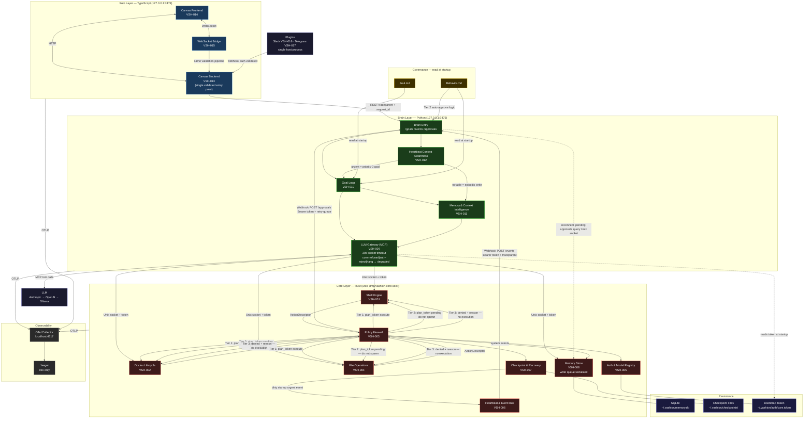

# Vashion — Architecture Graph
**Companion to:** Build_PRD.md
**Last Updated:** 2026-03-27

---

---

## Legend

| Color | Layer | Language |
|---|---|---|
| Blue | Web | TypeScript |
| Green | Brain | Python |
| Red | Core | Rust |
| Yellow | Governance | Markdown (Soul.md / Behavior.md) |
| Dark blue | Persistence | SQLite / filesystem |
| Grey | Observability | OTel Collector / Jaeger |
| Purple | External | LLM providers / Plugins |

## Key Design Decisions

| Decision | Rationale |
|---|---|
| Single `BRAIN_ENTRY` node | One validated HTTP surface into Brain — WS and REST share the same gate |
| `PLUGINS → API` not `PLUGINS → GOAL` | Plugin webhooks auth-validated at Canvas Backend before Brain sees them |
| `MEM_I → MCP` for Core access | Brain has no direct SQLite connection — all memory I/O through Unix socket |
| `CHK → CKFILES` (disk only) | Checkpoint recovery is independent of database state — survives DB corruption |
| `HB_CTX → GOAL` and `HB_CTX → MEM_I` | Heartbeat awareness has two outbound paths: urgent events become goals, notable events become memory |
| Write queue in `MEM_S` | Core and Brain both write; serialized queue prevents last-write-wins race |
| Token epoch + rekey handshake | Brain self-recovers from Core restart mid-session; stale epoch detected, degraded state entered, token reloaded |
| `ActionDescriptor` schema on FW arrows | Classification is deterministic against typed fields — not prose; missing fields default to Tier 2 minimum |
| Admission control before spawn (Tier 2) | `plan_token` held; no process started before approval resolves — eliminates side-effects-before-suspend problem |
| Pending approval state in Core | Web renders approval state but does not own it — browser refresh and backend restart do not lose pending approvals |
| Durable memory promotion pipeline | 6-stage process with operator review and provenance backlinks — no silent promotion, no orphaned entries |
| Goal Loop resource lock model | workspace / container / system scopes; urgent preempts operator; scheduled promoted after 10min starvation |
| Core→Brain webhook auth (N2) | All `/approvals` and `/events` webhook calls carry `Authorization: Bearer <token>`; Brain validates before processing; undelivered approvals queued in Core and re-delivered on Brain reconnect |
| Unix socket timeout + degraded state (G1) | 30s per-call timeout; conn-refused/hang → degraded state (Goal Loop halts, Canvas alerts, 10s ping recovery); auth-reject → rekey protocol only |
